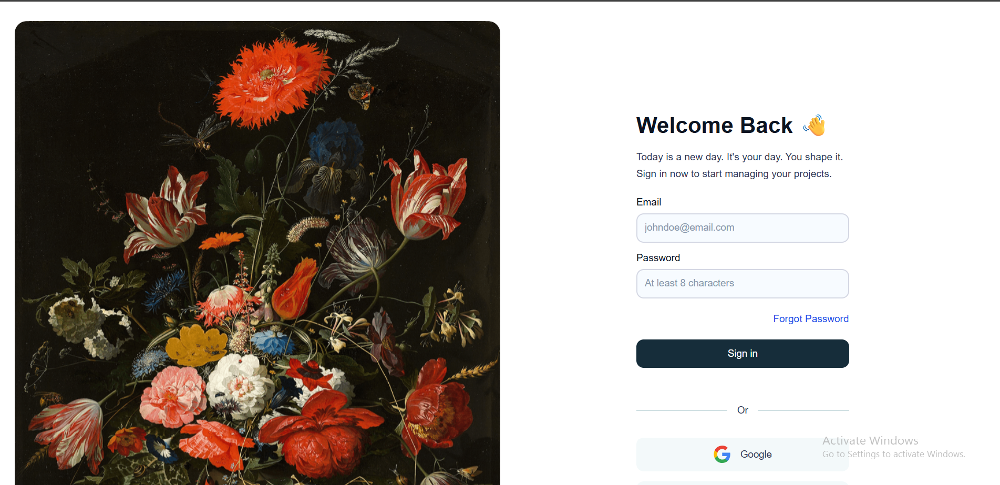
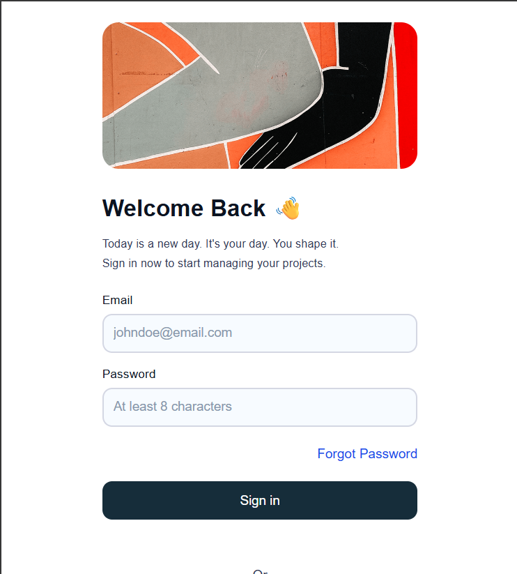

# Login Page UI

A responsive login page built with React by recreating a community Figma design.

> This project is part of my frontend development journey, where I'm practicing translating UI designs into clean, responsive React applications.

## 📸 Preview

### Desktop



### Mobile



## 🎨 Design Reference

Figma Community Design:
https://www.figma.com/design/LWa373ic5m5jJqNGlfLhAp/Login-Page--Community-

## ✨ Features

- Responsive layout
- Clean and modern UI
- Reusable React components
- Mobile-friendly design
- Pixel-close implementation of the original design

## 🛠️ Built With

- React
- JavaScript
- CSS3
- Vite

## 🚀 Getting Started

Clone the repository:

```bash
git clone https://github.com/TaylorOkis/Login-page.git
```

Navigate into the project:

```bash
cd Login-page
```

Install dependencies:

```bash
npm install
```

Start the development server:

```bash
npm run dev
```

Open your browser and visit:

```
http://localhost:5173
```

## 📂 Project Structure

```
src/
├── assets/
├── components/
├── App.jsx
├── main.jsx
└── index.css
```

## 📚 What I Learned

While building this project, I practiced:

- Translating a Figma design into code
- Building responsive layouts with CSS
- Creating reusable React components
- Managing spacing, typography, and image sizing
- Structuring a React project

## 🔮 Future Improvements

- Add form validation
- Password visibility toggle
- Dark mode
- Smooth animations
- Accessibility improvements

## 🙌 Acknowledgements

- Original UI design from the Figma Community
- Built as a frontend practice project

## 📄 License

This project is open source and available under the MIT License.
